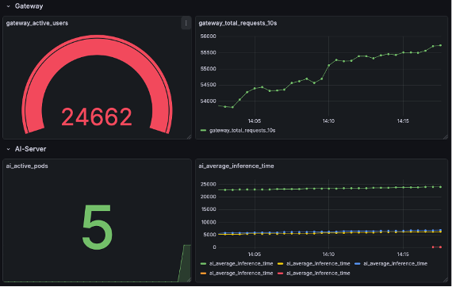
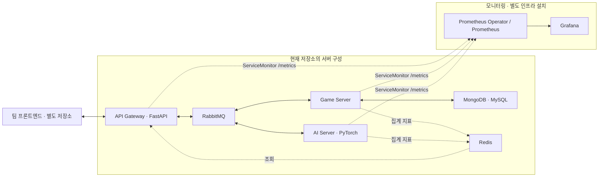

# TacticAI · AI 대전 플랫폼과 Kubernetes 모니터링

체스·오셀로·오목·틱택토의 AI 대전을 지원하는 분산 서버 팀 프로젝트입니다. 게임 처리, AI 추론, API Gateway를 분리하고 RabbitMQ로 요청과 결과를 전달합니다.

이 저장소에서는 **Prometheus·Grafana 모니터링을 담당한 이호철의 작업**을 중심으로 프로젝트를 소개합니다. 실제 서비스 통합 전 Mock-up 환경에서 수집·시각화 흐름을 먼저 검증하고, **AI Server Pod를 3대에서 5대로 늘렸을 때 설정 변경 없이 신규 Pod의 지표가 표시되는지 확인**했습니다.

| 항목 | 내용 |
| --- | --- |
| 기간 | 2025.09 ~ 2025.12 |
| 프로젝트 | 건국대학교 차세대분산시스템 수업 · 4인 팀 |
| 본인 역할 | Prometheus Operator 기반 메트릭 수집, Grafana 대시보드, Pod 확장 시 모니터링 검증 |
| 주요 기술 | Kubernetes, Docker, Prometheus, Grafana, RabbitMQ, FastAPI, Python |
| 저장소 범위 | 팀 서버·모델 코드, Helm 템플릿, ServiceMonitor 설정, 모니터링 검증 자료 |

[모니터링 설계와 검증](docs/MONITORING.md) · [실행 환경과 테스트 안내](docs/SETUP.md) · [팀 프로젝트 조직](https://github.com/KU-TacticAI)

## 모니터링 검증 화면



서비스 통합 전 **모의 트래픽과 Mock-up 메트릭으로 검증한 화면**입니다. AI Pod 5개와 Pod별 추론 지표를 확인할 수 있습니다. 표시된 접속자 수·요청 수·지연 값은 실서비스 이용 실적이나 성능 벤치마크가 아닙니다. 당시 Mock-up의 메트릭 이름과 현재 서버 코드의 이름은 다르며, 현재 이름은 [모니터링 문서](docs/MONITORING.md#현재-서버의-메트릭)에서 확인할 수 있습니다.

## 시스템 구조



- **Gateway**는 게임 요청과 진행 조회 API를 제공하고 내부 메시징 계층과 연결합니다.
- **Game Server**는 게임 규칙·턴 진행·상태 관리를 담당합니다.
- **AI Server**는 모델 로딩과 추론 요청을 처리합니다.
- **RabbitMQ**는 서비스 사이의 요청·결과 전달을, **Redis**는 서버별 집계 지표 공유를 지원합니다.
- **Prometheus·Grafana**는 서비스와 Pod 상태를 수집·시각화합니다.

## 본인 역할과 문제 해결

게임·AI 서버와 프론트엔드는 팀 전체 결과물입니다. 본인의 담당 범위는 모니터링 구성과 검증입니다.

| 문제 | 수행한 작업 | 확인한 결과 |
| --- | --- | --- |
| 서비스 통합 전에는 실제 지표와 장애 상황을 관찰하기 어려움 | Mock-up 서버와 모의 지표로 Gateway·AI·Game·RabbitMQ 모니터링을 선행 구성 | 메트릭 수집부터 Grafana 표시까지의 흐름을 사전 검증 |
| Pod가 증가하면 정적 대상 설정에서 신규 인스턴스가 누락될 수 있음 | Prometheus Operator의 ServiceMonitor·PodMonitor 기반 라벨 선택 방식 적용 | AI Pod 3대 → 5대 확장 시 설정 변경 없이 신규 Pod 지표 수집·분리 표시 확인 |
| 여러 서비스의 상태를 따로 확인해야 함 | 접속·요청, 추론, 게임 진행, 큐 상태를 한 대시보드에서 확인하도록 구성 | 서비스별 상태와 모의 큐 적체 상황을 함께 관찰 |

위 결과는 프로젝트 당시 모니터링 실험에 대한 기록입니다. 현재 저장소에는 ServiceMonitor 설정이 포함되어 있으며, 당시 PodMonitor 정의와 Grafana 대시보드 JSON은 포함되어 있지 않습니다. 화면 자료와 현재 소스의 재현 범위는 [상세 문서](docs/MONITORING.md)에 구분했습니다.

## 구현 코드 둘러보기

| 위치 | 내용 |
| --- | --- |
| [monitor.yaml](monitor.yaml) | Gateway·Game·AI 서버용 ServiceMonitor 3개 |
| [tacticai/mq_api_gateway](tacticai/mq_api_gateway) | FastAPI 요청·조회 API, RabbitMQ 연결, Gateway 메트릭 |
| [tacticai/game_server](tacticai/game_server) | 4종 게임 규칙, 게임 상태 관리, 서버 메트릭과 테스트 |
| [tacticai/ai_server](tacticai/ai_server) | 모델 로딩·추론 처리와 AI 서버 메트릭 |
| [tacticai/model](tacticai/model) | 게임별 AlphaZero·MCTS·신경망 학습 및 변환 코드 |
| [tacticai/helm/tacticai](tacticai/helm/tacticai) | 서버 Deployment·Service를 구성하는 Helm 차트 |

## 실행과 재현 범위

게임 규칙 테스트, 서버 이미지 빌드, 클러스터 모니터링 연결은 필요한 환경이 다릅니다. [실행 안내](docs/SETUP.md)에서 단계별로 확인할 수 있습니다.

```bash
git clone https://github.com/ho72/TacticAI-Monitoring.git
cd TacticAI-Monitoring
```

현재 Helm Service 템플릿에는 `monitor.yaml`이 선택하는 **Service 라벨과 포트 이름이 없어**, 모니터링을 재현할 때 이 연결 조건을 먼저 맞춰야 합니다. 실행 안내는 이 조건과 외부 인프라·모델 준비 범위를 함께 설명합니다.

이 저장소는 수업 프로젝트의 구현과 검증 자료를 보관합니다. 현재 상시 운영 중인 데모 서비스나 전체 스택을 한 번에 시작하는 검증된 설치 환경은 제공하지 않습니다.

## 관련 자료

- [모니터링 설계, 메트릭, 검증 화면과 연결 조건](docs/MONITORING.md)
- [환경 준비, 게임 규칙 테스트, 이미지 빌드와 배포 안내](docs/SETUP.md)
- [KU-TacticAI 팀 프로젝트 조직](https://github.com/KU-TacticAI)

문서와 이미지 정리: 2026.10.05
