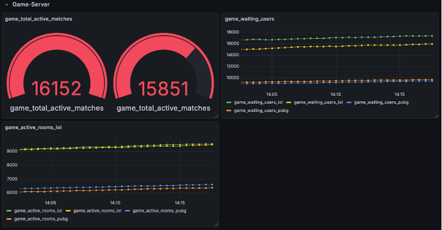
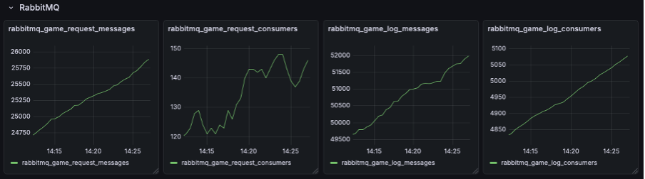

# 모니터링 설계와 검증

Gateway, AI Server, Game Server, RabbitMQ의 상태를 함께 관찰하기 위해 Prometheus와 Grafana를 구성했습니다. 실제 서비스 통합 전에는 Mock-up 서버와 모의 지표로 수집·표시 흐름을 먼저 검증했습니다.

## 수행한 작업

- Prometheus Operator의 ServiceMonitor·PodMonitor를 이용해 라벨 기반으로 수집 대상을 정의했습니다.
- Gateway 접속·요청, AI 추론, 게임 진행, RabbitMQ 큐 상태를 대시보드에서 확인하도록 구성했습니다.
- AI Pod를 3대에서 5대로 늘리고, 수집 설정을 바꾸지 않은 상태에서 신규 Pod 지표가 Grafana에 분리 표시되는지 확인했습니다.
- 모의 큐 적체 상황으로 RabbitMQ 지표 표시와 알람 흐름을 선행 검증했습니다.

이는 프로젝트 당시 수행한 실험입니다. 아래 화면은 당시 검증 자료이며, 지금의 통합 서비스나 실제 운영 트래픽을 측정한 결과는 아닙니다.

## 검증 화면

### Gateway와 AI Server


Gateway의 모의 활성 사용자·요청 흐름과 AI Pod 수·Pod별 추론 지표를 관찰한 화면입니다. AI Pod 수는 5로 표시됩니다. 이 한 장만으로 증설 전후의 전 과정을 보여주는 것은 아니며, 3대에서 5대로 늘리는 실험의 결과 화면으로 사용합니다.

### Game Server



활성 매칭·대기 사용자·방 수를 모의 지표로 표현했습니다. 화면의 종목 라벨은 사전 Mock-up용이며, 현재 구현된 게임 규칙은 체스·오셀로·오목·틱택토입니다.

### RabbitMQ



모의 큐 적체 시나리오에서 메시지와 소비자 관련 지표의 변화를 확인한 화면입니다.

화면은 기존 프로젝트 포트폴리오에 보존된 자료입니다. 화면의 Mock-up 메트릭 이름과 현재 서버의 메트릭 이름을 같은 버전으로 취급하지 않습니다.

## 현재 서버의 메트릭

아래 이름은 현재 저장소의 Python 소스에 선언된 메트릭입니다. 대시보드를 다시 작성할 때는 이 이름을 기준으로 조회합니다. 현재 클러스터에서 수집이 정상 동작하는지 다시 검증한 결과를 뜻하지는 않습니다.

| 서비스 | 메트릭 예시 | 용도 |
| --- | --- | --- |
| Gateway | `gateway_http_requests_total`, `gateway_http_request_duration_seconds` | HTTP 요청 수와 처리 시간 |
| Gateway | `gateway_active_connections`, `gateway_active_game_sessions` | 연결·게임 세션 상태 |
| Gateway | `gateway_rabbitmq_connection_status`, `gateway_rabbitmq_publish_failures_total` | RabbitMQ 연결·메시지 발행 상태 |
| AI Server | `ai_inference_time_seconds`, `ai_inferences_total`, `ai_server_status_code` | 추론 시간·건수·서버 상태 |
| Game Server | `game_active_matches`, `game_waiting_users`, `game_status_code` | 게임 종류별 매칭·대기·상태 |

선언 위치:

- [Gateway 메트릭](../tacticai/mq_api_gateway/gateway_metrics.py)
- [AI Server 메트릭](../tacticai/ai_server/main.py)
- [Game Server 메트릭](../tacticai/game_server/main.py)

AI 추론 건수는 현재 코드에서 Gauge로 선언되어 있습니다. 조회·집계 시 이름만 보고 Counter라고 가정하지 않아야 합니다.

## ServiceMonitor 연결 조건

[monitor.yaml](../monitor.yaml)은 `tacticai` 네임스페이스의 Service를 대상으로 15초마다 `/metrics`를 수집하도록 정의합니다.

| ServiceMonitor | Service의 `metadata.labels` 조건 | Service 포트 이름 | 현재 소스의 메트릭 포트 |
| --- | --- | --- | --- |
| `gateway-monitor` | `app: mq-api-gateway` | `http-api` | 8000 |
| `game-server-monitor` | `app: game-server` | `game-metrics` | 8002 |
| `ai-server-monitor` | `app: ai-server` | `ai-metrics` | 8001 |

ServiceMonitor의 선택 대상은 **Service의 메타데이터 라벨**입니다. Service의 `spec.selector`는 Service와 Pod를 연결하는 별도의 조건입니다. Prometheus는 자신의 ServiceMonitor 선택 조건으로 모니터를 선택하고, ServiceMonitor는 Service 라벨과 포트 이름으로 수집 대상을 선택합니다. [Prometheus Operator 공식 안내](https://prometheus-operator.dev/docs/developer/getting-started/#using-servicemonitors)

현재 [Helm 템플릿](../tacticai/helm/tacticai/templates)은 Pod 라벨과 Service의 Pod selector를 정의하지만, Service의 `metadata.labels.app`과 `spec.ports[].name`은 정의하지 않습니다. 따라서 이 차트와 `monitor.yaml`을 연결하려면 위 표의 Service 라벨·포트 이름을 배포 설정에 반영해야 합니다. Pod 라벨만 맞추는 것으로는 충분하지 않습니다.

추가로 필요한 조건:

- Prometheus Operator와 ServiceMonitor CRD, 실행 중인 Prometheus가 있어야 합니다.
- Prometheus의 ServiceMonitor 라벨 선택 조건이 현재 모니터의 `release: monitoring`과 맞아야 합니다.
- Prometheus의 ServiceMonitor 네임스페이스 선택 조건이 `tacticai`를 포함해야 합니다.
- Gateway의 `/metrics`는 인증을 사용합니다. `gateway-monitor`가 참조하는 `tacticai` 네임스페이스의 `gateway-token` Secret과 `token` 키가 서버 인증 설정과 맞아야 합니다.
- Grafana는 설치한 Prometheus를 데이터 소스로 사용해야 합니다.

## 연결 확인 순서

실행 중인 클러스터에서 Service 라벨과 포트 이름을 먼저 확인합니다.

```bash
kubectl get crd servicemonitors.monitoring.coreos.com
kubectl get prometheus -A
kubectl -n tacticai get services --show-labels
kubectl -n tacticai get services \
  -o 'custom-columns=NAME:.metadata.name,PORT_NAMES:.spec.ports[*].name,PORTS:.spec.ports[*].port'
```

위 연결 조건을 맞춘 뒤 모니터를 적용하고 대상을 확인합니다.

```bash
kubectl apply -f monitor.yaml
kubectl -n tacticai get servicemonitors
kubectl -n tacticai get endpointslices
```

Prometheus의 Targets에서 세 서비스가 표시되고 수집 상태가 정상인지 확인합니다. Gateway 인증 오류, Service 라벨 불일치, 포트 이름 불일치, 네임스페이스 선택 누락을 구분해서 점검합니다.

## Pod 확장 검증 절차

다음은 당시 검증을 다시 수행하기 위한 절차입니다. AI Pod 수를 늘리기 전에 GPU 자원·노드 조건과 각 Pod의 모델 준비 상태가 충족되어야 합니다.

1. AI Deployment를 3개 replica로 구성하고 Pod별 Target과 지표를 확인합니다.
2. Deployment를 5개 replica로 늘립니다.
3. Prometheus 수집 설정을 수정하지 않고 신규 Target이 추가되는지 확인합니다.
4. Grafana에서 Pod별 지표가 구분되는지 확인합니다.
5. 검증 후 실험에 맞는 replica 수로 복구합니다.

```bash
kubectl -n tacticai scale deployment ai-server --replicas=3
kubectl -n tacticai rollout status deployment/ai-server
kubectl -n tacticai scale deployment ai-server --replicas=5
kubectl -n tacticai rollout status deployment/ai-server
kubectl -n tacticai get pods -l app=ai-server
```

Pod 수만 세는 것과 실제 수집 성공은 다릅니다. `up` 상태, Target 수, 신규 Pod의 시계열, Grafana 표시를 함께 확인하는 것이 검증 기준입니다.

## 저장된 자료의 범위

현재 저장소에는 ServiceMonitor 세 개, 서비스 메트릭 코드, 검증 화면이 있습니다. 당시 사용한 PodMonitor manifest, Grafana 대시보드 JSON, Prometheus 설치 설정과 전체 Mock-up 서버는 포함되어 있지 않습니다. 따라서 제공된 화면을 자동으로 복원하는 대시보드 설치 패키지는 아닙니다.
